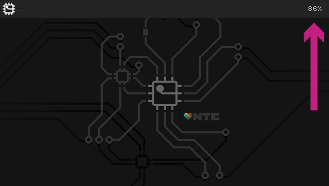
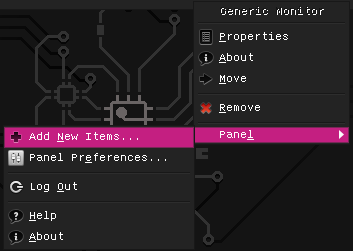
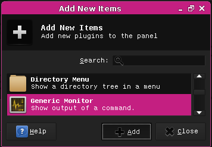
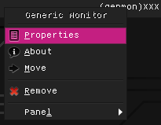
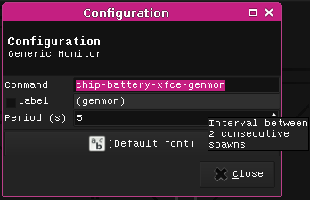

# C.H.I.P. battery status for xfce4 desktop

A simple script to display battery percentage 
on the xfce4 desktop on NextThing.co's C.H.I.P.

Works nicely with PocketC.H.I.P.



## How to install
Download/clone the files to your C.H.I.P.
```
cd chip-battery-status
sudo ./install.sh
```

Now you need to add a panel item to your xfce4 desktop.

1. Right-click (_or Ctrl-click_) on an existing panel item,
e.g your clock. Choose `Panel > Add New Items...`



2. Select `Generic Monitor` from the list and hit `Add`



3. You'll see `(genmon) xxx` appear in your panel. Right-click 
(_or Ctrl-click_) it and choose `Properties`



4. In the `Command` field enter `chip-battery-xfce-genmon` and
for the `Period (s)` enter `5`. Hit `Close`



5. Enjoy. 🍹 🌴

## Customisation
If you're keen you can change the way the battery status is
displayed by editing `/usr/local/bin/chip-battery-xfce-genmon`.

Follow the instructions on the [xfce4-genmon-plugin](http://goodies.xfce.org/projects/panel-plugins/xfce4-genmon-plugin)
page to change colours, add images, etc.